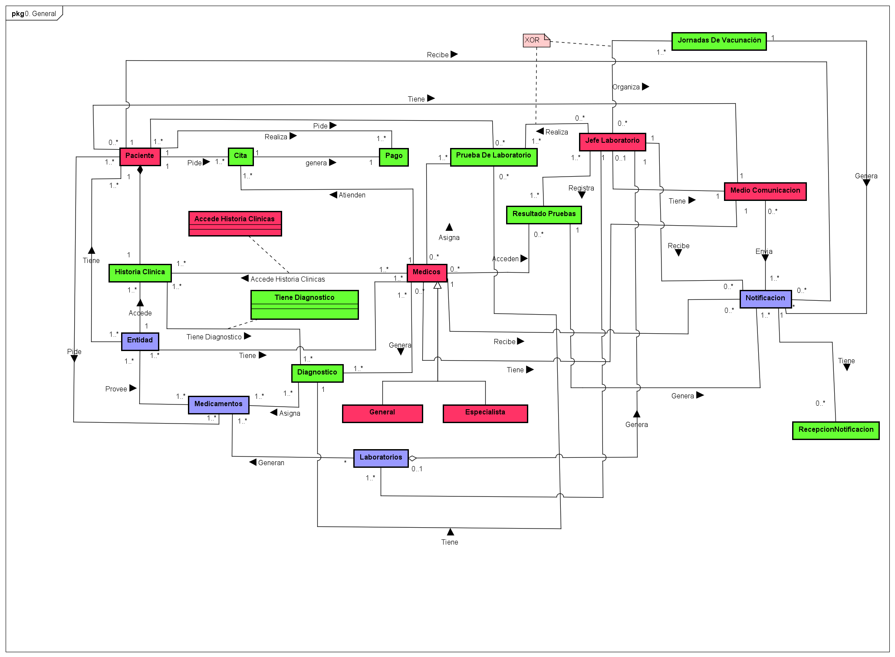

# CareBaseSystems

Care Base Systems mission is to solve the day-to-day problems faced by hospitals regarding data flow and management, for example, when scheduling appointments or accessing patient medical records.

Among the stakeholders is the government, and especially the Ministry of Health, which would benefit because the system will allow for better coordination and control of resources nationwide. Likewise, the Ministry of Health could obtain real-time data on the demand for medical services, and the health authorities could verify the system's effectiveness.

## Class diagram

## 🚀 Getting Started
Follow these instructions to run the project locally for development or testing purposes.

### ✅ Prerequisites
Make sure you have the following installed:

- **SQL Developer**
- *(Optional)* An IDE such as **VS Code**, **IntelliJ IDEA**, or **Eclipse**

---

## Authors

- [@Tulio3101](https://github.com/tulio3101)
- [@JulianLopez11](https://github.com/JulianLopez11)

